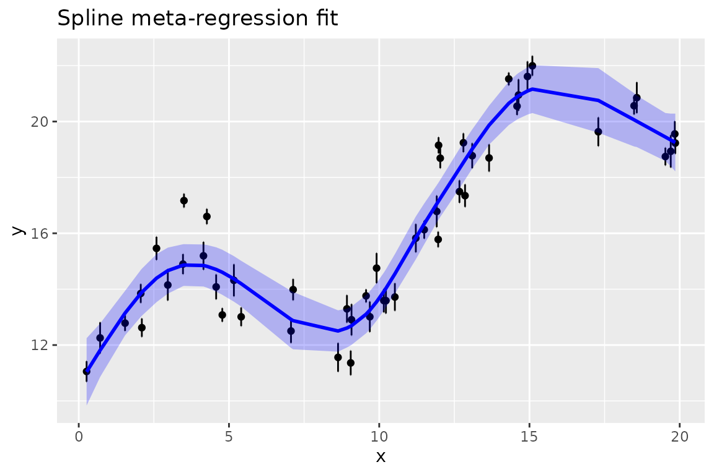

# splinemixmeta

## Introduction

Package `splinemixmeta` provides some basic capabilities in
non-parametric meta-regression. If one has responses `y`, each with a
standard error, from previous analyses, and wants to regress those
against study-level explanatory variables `x` without assuming
linearity, `splinemixmeta` allows an arbitrary smooth relationship to be
estimated as a smoothing spline. It is also possible to include other
explanatory variables (assumed to have a linear relationship to `y`) and
random effects groupings. Such an approach may be referred to as
“non-parametric meta-analysis”, “spline meta-regression”,
“meta-splines”, or other similar terminology mash-ups.

`splinemixmeta` works by bringing together features of `mgcv` for
building spline components and `mixmeta` for estimating general
mixed-effects meta-analysis models. Specifically, the splines of `mgcv`
can be used as random effects components, with the penalty matrix
providing a correlation structure for spline coefficients, the unknown
smoothness parameter replaced by an unknown variance parameter, and any
unpenalized directions in the spline parameter space (e.g. spline
parameters representing a linear relationship) moved into fixed effects.
The resulting pieces are then set up as needed for a call to
[`mixmeta::mixmeta`](https://rdrr.io/pkg/mixmeta/man/mixmeta.html) for
estimating the model. Variance parameters are always estimated by REML
(restricted maximum likelihood).

There are some important limits on what will work. At the moment, the
only recommended spline basis functions are `bs="cr"`, “bs=`cs`”, and
`bs="cc"`. These are supported because the associated covariance
matrices can be diagonalized. The `mgcv` default of `bs="tp"` does not
currently produce good results. One can have multiple spline components,
although this is rather limited because most of the choices in `mgcv`
for bivariate splines are not among those supported. It is possible that
`bs = 'mrf'` also works, but it has not been tested. See
[`help(splinemixmeta)`](https://fawda123.github.io/splinemixmeta/reference/splinemixmeta.md)
for more about what is supported.

The estimation machinery is not particularly efficient and so may be
notably slow for large models.

## Example

Here we give a simulated example. Say we have `n=50` values, with 5
values from each of 10 groups, with a sinusoidal relationship between
`y` and `x` to provide a simple nonlinear example. The groups will be
treated as random effects, as will the spline.

### Data simulation

``` r
set.seed(1)
n <- 50
num_groups <- 10
group <- rep(1:num_groups, each = 5) |> factor()
group_effects <- rnorm(length(group), 0, 0.3)
x <- runif(n, 0, 20)
coef_x <- 0.6
se <- runif(n, 0.1, 0.3)
fx <- 1.5 * sin(2 * pi * x / 12)
y <- 10 + coef_x * x + fx + 
  group_effects[group] +
  fx + rnorm(n, 0, 1) + rnorm(n, 0, se)
data <- data.frame(y, x, se, group)
plot(y ~ x, data = data, col = group, pch = 19, main = "Simulated data (color = group)")
```


This data simulation has the following pieces:

- We have 10 groups of 5 data points each. Since the `x` values are all
  drawn independently, the groups are independent from `x`.
- `x` is uniformly distributed from 0 to 20.
- We assume each `y` was obtained separately from a previous study, and
  these studies are grouped in some relevant way.
- Fixed effects for `y` include an intercept and linear term.
- Random effects for `y` include the group effects.
- The sinusoidal term for `y` will be estimated as a spline, treated as
  a random effect.
- Residuals are normally distributed with `sd = 1`.
- Measurement errors (i.e. estimation error from the previous studies
  from which `y` were obtained) are normally distributed with standard
  deviations that are the standard errors (`se`) from the previous
  studies. These standard errors are simulated as uniformly distributed
  between 0.1 and 0.3 to reflect heterogeneity in the precision of the
  previous studies.

### Estimation of a spline meta-regression model

The spline meta-regression model can be estimated like this:

``` r
library(splinemixmeta)
smm <- splinemixmeta( mgcv::s(x, bs = "cr"), y ~ x, 
                      se = se, manual_fixed = TRUE, 
                      data = data, random = ~ 1 | group)
```

The object `smm` will have class “splinemixmeta” and “mixmeta”. First we
can look at a summary of the model:

``` r
summary(smm)
#> Call:  mixmeta::mixmeta(formula = y ~ x, S = (se)^2, data = data, random = list(
#>     ~basisFxns_A - 1 | all, ~1 | group, ~1 | ID), bscov = c("id", 
#> "unstr", "unstr"))
#> 
#> Univariate extended random-effects meta-regression
#> Dimension: 1
#> Estimation method: REML
#> 
#> Fixed-effects coefficients
#>              Estimate  Std. Error        z  Pr(>|z|)  95%ci.lb  95%ci.ub     
#> (Intercept)   11.6246      0.3215  36.1600    0.0000   10.9945   12.2547  ***
#> x              0.4509      0.0265  17.0192    0.0000    0.3990    0.5028  ***
#> ---
#> Signif. codes:  0 '***' 0.001 '**' 0.01 '*' 0.05 '.' 0.1 ' ' 1 
#> 
#> Random-effects (co)variance components
#>  Formula: ~basisFxns_A - 1 | all
#>  Structure: Multiple of identity
#>               Std. Dev          Corr                                          
#> basisFxns_A1    0.4490  basisFxns_A1  basisFxns_A2  basisFxns_A3  basisFxns_A4
#> basisFxns_A2    0.4490             0                                          
#> basisFxns_A3    0.4490             0             0                            
#> basisFxns_A4    0.4490             0             0             0              
#> basisFxns_A5    0.4490             0             0             0             0
#> basisFxns_A6    0.4490             0             0             0             0
#> basisFxns_A7    0.4490             0             0             0             0
#> basisFxns_A8    0.4490             0             0             0             0
#>                                                       
#> basisFxns_A1  basisFxns_A5  basisFxns_A6  basisFxns_A7
#> basisFxns_A2                                          
#> basisFxns_A3                                          
#> basisFxns_A4                                          
#> basisFxns_A5                                          
#> basisFxns_A6             0                            
#> basisFxns_A7             0             0              
#> basisFxns_A8             0             0             0
#> 
#>  Formula: ~1 | group
#>  Structure: General positive-definite
#>   Std. Dev
#>     0.4097
#> 
#>  Formula: ~1 | ID
#>  Structure: General positive-definite
#>   Std. Dev
#>     0.8835
#> 
#> Univariate Cochran Q-test for residual heterogeneity:
#> Q = 6358.8466 (df = 48), p-value = 0.0000
#> I-square statistic = 99.2%
#> 
#> 50 units, 1 outcome, 50 observations, 2 fixed and 3 random-effects parameters
#>   logLik       AIC       BIC  
#> -76.3152  162.6304  171.9864
```

The spline terms are labeled as `basisFxns_A`. Further splines would be
`basixFxns_B`, etc.

Two factors have been introduced. One is called `all`, which has a
single level for every row of the data, which facilitates use of
[`mixmeta::mixmeta`](https://rdrr.io/pkg/mixmeta/man/mixmeta.html). The
other is called `ID`, which has a unique value for each row. In
meta-regression, it can be tempting to think that the standard errors
associated with `y` values serve as the only source of residual
variation, but that is not typically the case. If each `y` came from a
large sample size in the previous studies, the standard errors would be
small, but we would still expect study-level variation around any
regression line because the world is noisy. That study-level variation,
i.e. additional residual variation, is set up as a random effect with
one level for each `y`.

By using `y ~ x`, we included a linear term for `x` directly (manually),
and thus we needed to set `manual_fixed = TRUE`. Otherwise
`splinemixmeta` would have obtained a linear term from the spline setup
and included it in the model, and we don’t want it duplicated. (Such a
linear term, or more generally unpenalized dimensions of the spline
coefficients, will always be removed from the smooth term when it is
converted into the format of a random effect.) In the `summary` output,
we see the full covariance matrix from the spline random effect, which
is the vector spline coefficients. This is shown as the standard
deviation for each component (all the same) and their correlations (all
0), reflecting a covariance matrix that is a constant times an identity
matrix. It has this structure because the random effects structure from
the spline basis functions and penalty matrix are rotated on order to
work with a diagonal covariance matrix.

Finally we see the estimated standard deviation between groups and the
estimated residual standard deviation, shows as the `~1 | ID` term.

(If the default names `all` or `ID` are already used in the data set,
`splinemixmeta` will choose different names.)

### Predictions

Predictions can be obtained at multiple levels of the random effects.
The `predict` function for `splinemixmeta` objects simplifies this by
allowing the simple choices of including any spline terms (default
`TRUE`), other random effects (default `FALSE` but possibly of interest)
and residuals (default `FALSE` and typically not of interest).
Predictions will come with columns for standard errors and variances
(simply the squared standard errors). The machinery for predictions is
modified from
[`mixmeta::blup()`](https://rdrr.io/pkg/mixmeta/man/blup.html), where
“blup” means “best linear unbiased predictor”, a standard term in linear
mixed effects modeling. Hence the column of predictions returned by
`predict` is labeled “`blup`”. The blups come from the conditional
distribution of random effects, given the data and estimated variance
parameters. Following
[`mixmeta::blup`](https://rdrr.io/pkg/mixmeta/man/blup.html),
predictions can be of type “outcome”, in which case variance from fixed
effects terms is included in the prediction variance (and standard
errors), or “residual”, in which case only variance from random effects
is included. The default is “outcome”. See
[`help(predict.splinemixmeta)`](https://fawda123.github.io/splinemixmeta/reference/predict.splinemixmeta.md)
for details. Any further fine-grained control (such as including one
spline but not another), can be done by calling
[`splinemixmeta::blup()`](https://rdrr.io/pkg/mixmeta/man/blup.html)
directly.

Here are two versions of predictions:

``` r
pred_spline_only <- predict(smm, include_smooths = TRUE, include_REs = FALSE, include_residuals = FALSE, type = "outcome")
pred_spline_and_groups <- predict(smm, include_smooths = TRUE, include_REs = TRUE, include_residuals = FALSE, type = "outcome")
# look at both together
head(cbind(pred_spline_only, pred_spline_and_groups))
#>       blup        se      vcov     blup        se      vcov
#> 1 19.01618 0.3506960 0.1229877 18.74330 0.4357595 0.1898863
#> 2 12.91852 0.5107873 0.2609037 12.64564 0.5430035 0.2948528
#> 3 14.19637 0.4093650 0.1675797 13.92349 0.4706131 0.2214767
#> 4 19.25014 0.5170299 0.2673199 18.97727 0.5765052 0.3323583
#> 5 18.31537 0.3538785 0.1252300 18.04249 0.4386054 0.1923747
#> 6 14.81859 0.3818512 0.1458104 15.43221 0.4673896 0.2184530
# look at only fixed effect, which could be done with `predict`
# but here we illustrate a direct call to `blup`
blup(smm, level=0, vcov = TRUE, se = TRUE) |> head()
#>       blup        se       vcov
#> 1 17.52867 0.2001708 0.04006835
#> 2 14.80961 0.1982734 0.03931235
#> 3 14.06172 0.2192172 0.04805620
#> 4 20.57627 0.3187314 0.10158973
#> 5 17.33722 0.1958174 0.03834447
#> 6 13.54724 0.2373041 0.05631323
```

### Figures

`splinemixmeta` provides a basic capability for figures, for which the
suggested package `ggplot2` is needed.

``` r
plot(smm, ylab = "y", title = "Spline meta-regression fit")
```



In this figure, the `y` values are shown with approximate 95% confidence
intervals calculated as +/- 2 standard errors, from the standard errors
that were input as the `se` argument to `splinemixmeta`. The fitted line
by default includes fixed effects and spline terms (blups), with a 95%
confidence envelope.
